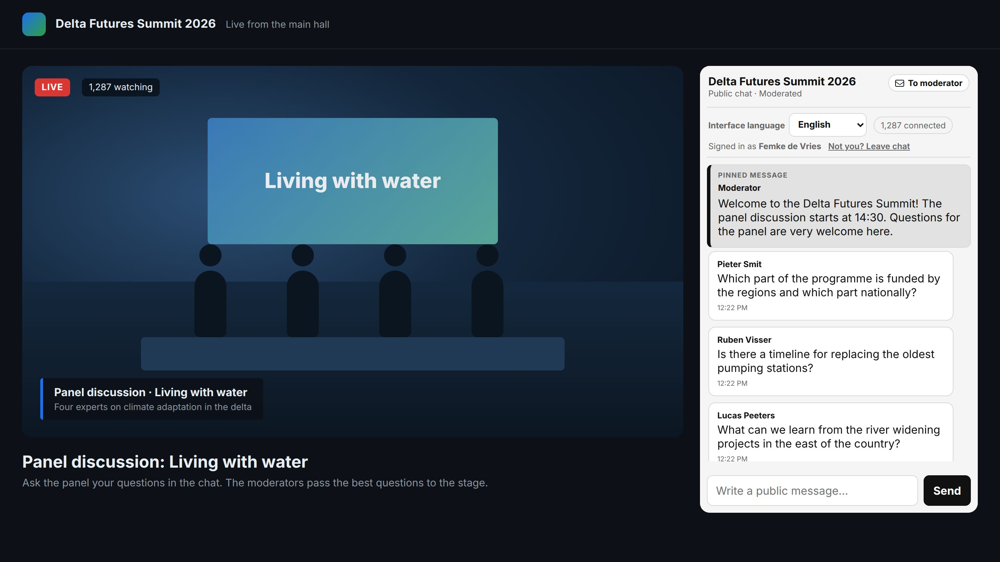
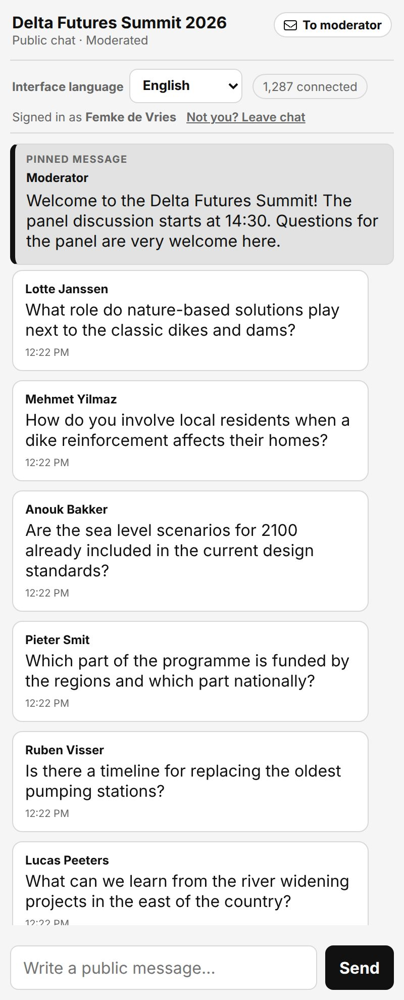
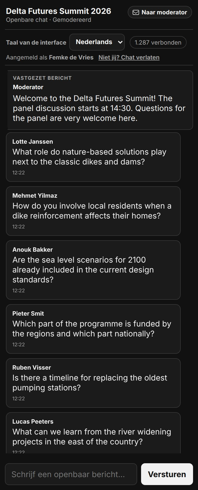
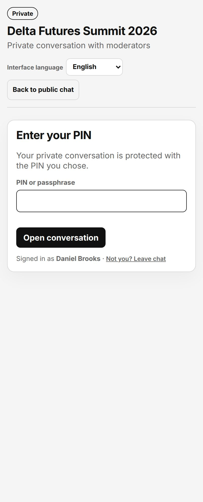
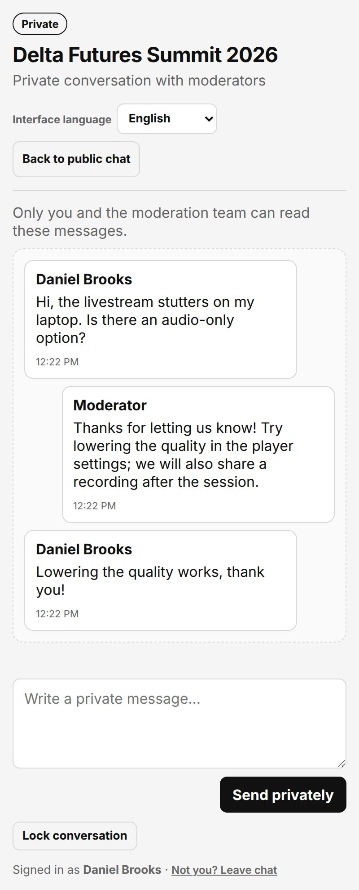
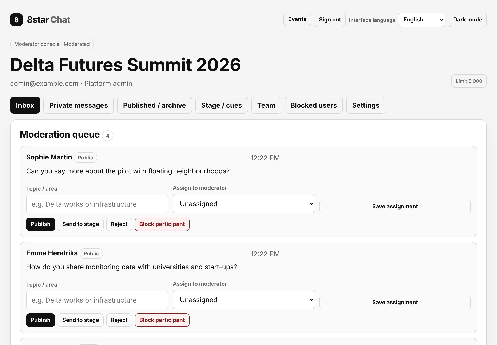
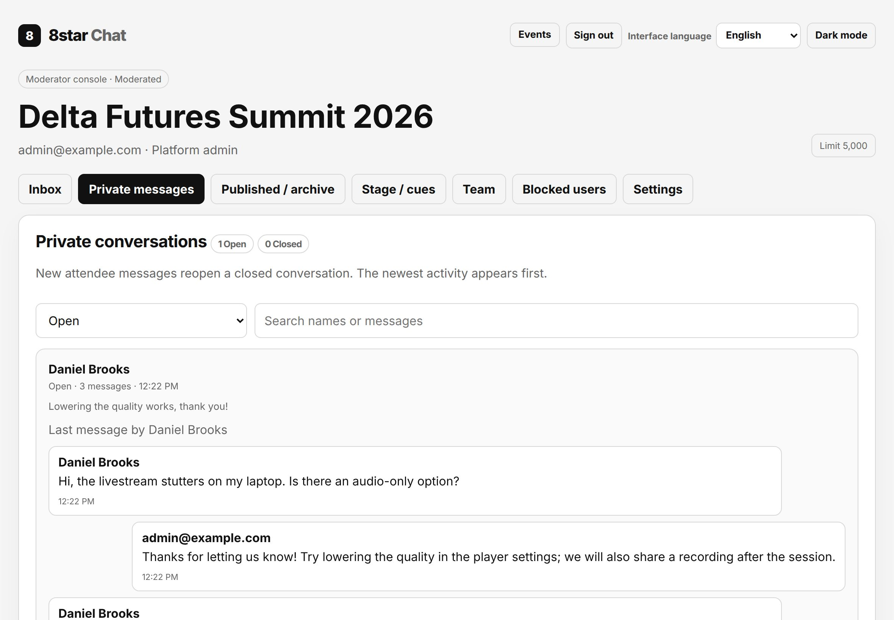
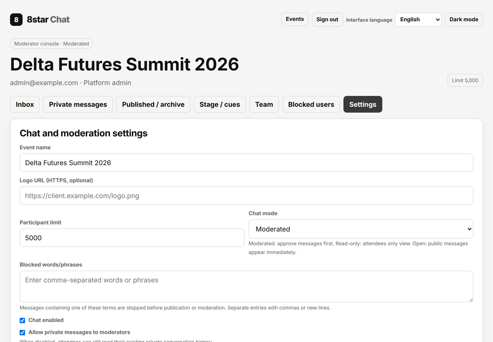
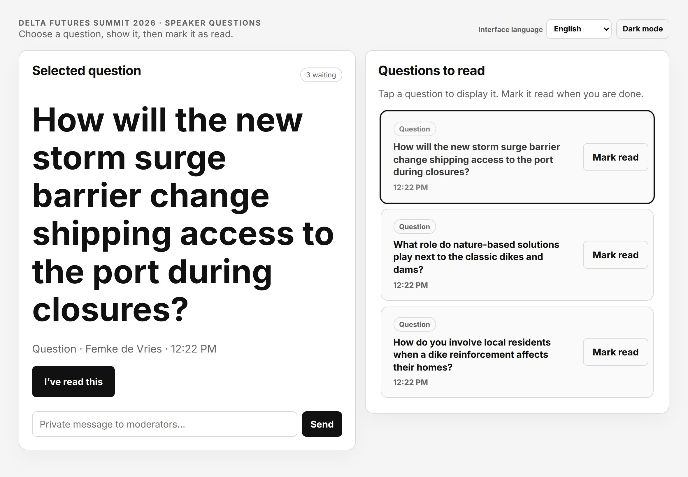
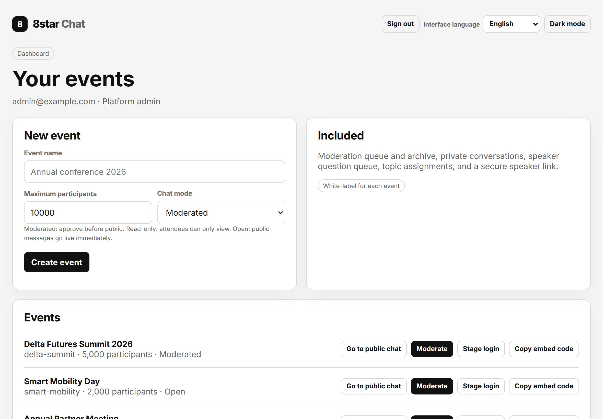

# 8star Chat

A self-hosted, white-label event chat that runs beside your livestream. Attendees ask questions in a public chat or privately to the moderators; moderators approve, answer and archive them, and pass the best questions to the speakers on an iPad.

Built with Node.js. No external database: everything is stored in one Docker volume.



## Features

- Three chat modes per event: **Moderated** (approve first), **Open** (messages appear immediately) or **Read-only**
- Embeds as an iframe on any livestream page; white-label per event (name and logo)
- Private conversation with the moderators, protected by a personal PIN
- Moderator console with inbox, archive, private messages and topic assignment
- Pin announcements and attendee questions above the chat (up to five)
- iPad-friendly speaker queue and a temporary speaker link with QR code
- Blocked words, blocking by session or IP address, and an unblock list
- Moderator, stage and event-owner accounts per event
- CSV export of the full message history
- Interface in English, Dutch, German and French; light and dark mode
- Built for large audiences: thousands of attendees on one container, with fast and explicit answers when a limit is reached
- Docker, Dockhand and Portainer support

## Screenshots

### Attendees

| Public chat                                                                               | In Dutch, dark mode                                                                                       |
| ----------------------------------------------------------------------------------------- | --------------------------------------------------------------------------------------------------------- |
|              |       |
| **Private conversation: enter PIN**                                                       | **Private conversation with the moderators**                                                              |
|  |  |

### Moderators



| Private messages                                                                          | Event settings                                                                                         |
| ----------------------------------------------------------------------------------------- | ------------------------------------------------------------------------------------------------------ |
|  |  |

### Speakers and events

| Speaker queue on an iPad                                                            | Event overview                                                    |
| ----------------------------------------------------------------------------------- | ----------------------------------------------------------------- |
|  |  |

_All names, events and messages in the screenshots are fictional._

## Quick start

Create a `compose.yaml` file. Docker builds the image straight from this repository:

```yaml
services:
  8star-chat:
    build:
      context: https://github.com/TimoM84/8star-chat.git#main
    image: 8star-chat:latest
    pull_policy: build
    restart: unless-stopped
    ports:
      - "9876:3000"
    environment:
      ADMIN_EMAIL: admin@example.com
      ADMIN_PASSWORD: choose-a-long-password
      ROOM_PUBLISH_PER_SECOND: "50"
      TRUST_PROXY: "true"
      METRICS_LOG_SECONDS: "60"
    volumes:
      - 8star_chat_data:/data
    ulimits:
      nofile:
        soft: 65536
        hard: 65536
    read_only: true
    tmpfs:
      - /tmp
    cap_drop:
      - ALL
    security_opt:
      - no-new-privileges:true
    stop_grace_period: 15s

volumes:
  8star_chat_data:
```

Start the application:

```bash
docker compose up -d
```

Open `http://YOUR-SERVER-IP:9876` and sign in with `ADMIN_EMAIL` and `ADMIN_PASSWORD` (at least 12 characters; only used for the first start).

`#main` always builds the newest version. To stay on a fixed release, use a tag instead, for example `#v0.7.1`.

## Dockhand and Portainer

1. Create a new stack.
2. Paste the Compose configuration from the Quick start section, or choose **From Git** with repository `https://github.com/TimoM84/8star-chat.git` and compose file `compose.yaml`.
3. Set the environment values (mark `ADMIN_PASSWORD` as a secret where possible) and deploy.

The named volume keeps all data when the container is rebuilt or replaced. Never choose to remove the volume when you remove the stack.

## Build from source

```bash
git clone https://github.com/TimoM84/8star-chat.git
cd 8star-chat
ADMIN_PASSWORD=choose-a-long-password docker compose up -d --build
```

## Embedding in a livestream page

Copy the embed code from the event list or from **Settings** in the moderator console, or use:

```html
<iframe
  src="https://chat.example.com/e/your-event"
  style="width:100%;height:650px;border:0"
  title="Live chat"
></iframe>
```

Set `FRAME_ANCESTORS` to the address of the livestream page (for example `https://live.example.com`) to allow only that site to embed the chat.

## Behind a reverse proxy

Run the chat behind a reverse proxy with HTTPS (for example Nginx Proxy Manager) and set `TRUST_PROXY=true`.

- Configure the proxy for long-lived Server-Sent Events connections without buffering.
- Pass `Host` (or `X-Forwarded-Host`), `X-Forwarded-Proto` and `X-Forwarded-For`.
- Every connected attendee uses up to four proxy connections over HTTP/1.1, so size the proxy's `worker_connections` × `worker_processes` for your audience.

## First use

1. Sign in with the platform admin account.
2. Create an event and choose **Moderated**, **Read-only** or **Open**.
3. Add moderators and the topics each of them handles. Create an event owner if someone needs to manage this event without access to the platform.
4. Assign questions by topic in the inbox. Send a question from the inbox or archive to **Stage / cues**; the speaker selects it on an iPad and marks it read.
5. Answer attendees in **Private messages** and close conversations when resolved. New attendee messages reopen a closed conversation.
6. Pin announcements from **Published / archive**. Use **Blocked users** to restore access when needed.
7. Add blocked words and enable or disable private messages in **Settings**.
8. Export the full message history as CSV from **Published / archive** or **Settings**.
9. Create a temporary speaker link and QR code in **Stage / cues**.

## Pages

- `/` — administration and event list
- `/e/<event-slug>` — attendee chat (the iframe)
- `/private/<event-slug>` — attendee private conversation, opened from the public chat
- `/moderator/<event-slug>` — moderator console
- `/stage/<event-slug>` — speaker queue
- `/health` — health check

## Settings

| Variable                      | Default               | Meaning                                                                                                                                                                                               |
| ----------------------------- | --------------------- | ----------------------------------------------------------------------------------------------------------------------------------------------------------------------------------------------------- |
| `ADMIN_EMAIL`                 | `admin@example.com`   | Platform admin e-mail for the first start.                                                                                                                                                            |
| `ADMIN_PASSWORD`              | – (required)          | Platform admin password for the first start, at least 12 characters. Changing it later does not change the stored password.                                                                           |
| `PORT`                        | `3000`                | Port inside the container.                                                                                                                                                                            |
| `DATA_DIR`                    | `/data`               | Data directory (the volume).                                                                                                                                                                          |
| `DEFAULT_MAX_USERS`           | `10000`               | Default participant limit for new events.                                                                                                                                                             |
| `MAX_MESSAGE_LENGTH`          | `500`                 | Maximum message length.                                                                                                                                                                               |
| `ROOM_PUBLISH_PER_SECOND`     | `5`                   | Maximum public publications per event per second.                                                                                                                                                     |
| `FRAME_ANCESTORS`             | `*`                   | Origins that may embed the chat (space-separated), e.g. `https://live.example.com`.                                                                                                                   |
| `TRUST_PROXY`                 | `true` in Compose     | Trust `X-Forwarded-For`/`-Proto`/`-Host`. Enable only behind a reverse proxy that sets these headers. Needed for IP blocking and for detecting HTTPS.                                                 |
| `COOKIE_SECURE`               | `auto`                | `auto` marks cookies `Secure` when the request arrived over HTTPS (directly, or per `X-Forwarded-Proto` with `TRUST_PROXY=true`). Use `true` to always require HTTPS; `false` only for local testing. |
| `ALLOWED_ORIGINS`             | empty                 | Extra origins allowed to send state-changing requests. Normally empty.                                                                                                                                |
| `GUEST_SESSION_HOURS`         | `24`                  | Lifetime of an attendee session.                                                                                                                                                                      |
| `PRIVATE_UNLOCK_IDLE_SECONDS` | `900`                 | Idle time after which a private conversation locks again.                                                                                                                                             |
| `PIN_LOCK_SECONDS`            | `900`                 | Wait time after 5 wrong PINs.                                                                                                                                                                         |
| `MAX_GUEST_SESSIONS`          | `200000`              | Safety limit for stored attendee sessions.                                                                                                                                                            |
| `HEARTBEAT_SECONDS`           | `20`                  | Interval of the keep-alive comment on open streams.                                                                                                                                                   |
| `JOURNAL_FSYNC`               | `true`                | Flush the message journal to disk (`fdatasync`) before a message is confirmed. `false` keeps it in the OS cache only (survives an app crash, not a power or host failure).                            |
| `FANOUT_INTERVAL_MS`          | `100`                 | Live updates to attendees are written at most once per connection per interval (the first update after a quiet period goes out immediately).                                                          |
| `FANOUT_SLICE`                | `500`                 | Connections written per step before the server serves other requests again.                                                                                                                           |
| `SSE_MAX_BUFFER_KB`           | `256`                 | A stream whose unsent data exceeds this is closed (the browser reconnects and gets the recent history).                                                                                               |
| `OVERLOAD_LAG_MS`             | `1000`                | New messages are refused with 503 while the server has been unable to run a timer for this long.                                                                                                      |
| `MAX_PENDING_MESSAGES`        | `1000`                | Messages that may wait for the journal at the same time; more are refused with 503.                                                                                                                   |
| `MAX_PENDING_EVENTS`          | `5000`                | Live updates that may wait per event; new messages are refused with 503 when the queue is (nearly) full.                                                                                              |
| `LISTEN_BACKLOG`              | `4096`                | Accept queue of the listening socket (capped by the kernel's `net.core.somaxconn`).                                                                                                                   |
| `METRICS_LOG_SECONDS`         | `0` (`60` in Compose) | Write one JSON metrics line to the container log every N seconds (counts and timings only; no message text, names, cookies or tokens). `0` disables it.                                               |

## Data and backups

All data is stored in `/data` inside the container (the named volume):

- `state.json` contains events, accounts and messages.
- `messages-N.journal` contains messages confirmed since the last `state.json` snapshot; it is replayed at start-up and removed after the next snapshot.
- `guest-sessions.json` contains hashed attendee sessions and PIN hashes.
- `ip-block-key` and `session-key` are keys for keyed IP hashes and CSRF tokens. Raw IP addresses are not stored.

Back up the volume before major updates; a backup taken while the container is stopped is always consistent. Export the CSV before removing an event, the stack or its volume.

## Updating

With `#main` in the Compose file, redeploy the stack (or run `docker compose up -d --build`): the image is rebuilt from the newest version. With a tag, change the tag first. Changes per version are listed in the [changelog](CHANGELOG.md).

## Privacy and security

- Attendee sessions are created by the server and kept in an `HttpOnly` cookie; only a hash of the session secret is stored.
- Private conversations need a personal PIN or passphrase, with lock-outs after wrong attempts and an automatic lock after 15 minutes without activity.
- Public pages and streams never contain private messages, attendee ids or IP hashes. Staff e-mail addresses are never shown to attendees.
- State-changing requests are checked for origin and CSRF token; staff sign-in is rate limited.
- The container runs as a non-root user with a read-only file system, no capabilities and `no-new-privileges`.

Details: [Architecture, privacy and capacity](docs/architecture.md).

## Capacity

One container serves thousands of connected attendees. New messages are confirmed as soon as they are safely stored, then delivered to all attendees in batches. When a limit is reached the sender gets an immediate, explicit answer instead of a time-out, and a message is never published twice. In practice the reverse proxy, TLS and network bandwidth are usually the limit before the app is: at 50 messages per second and 5,000 attendees the chat sends about 410 Mbit/s of event data.

Measurements, limits and the path to running on several servers: [Architecture, privacy and capacity](docs/architecture.md). How to measure your own setup: [Load testing](docs/load-testing.md).

## Development and tests

```sh
npm ci
npm test              # privacy, sessions, PIN, CSRF/Origin, translations, configuration,
                      # overload/idempotency/journal/delivery behaviour
npm run check:i18n    # missing, unused or untranslated interface texts
```

Translations live in `public/i18n-core.js` (English text is the key, followed by Dutch, German and French). Code is formatted with Prettier (`npx prettier --write .`). Load-test tools are described in [docs/load-testing.md](docs/load-testing.md).
